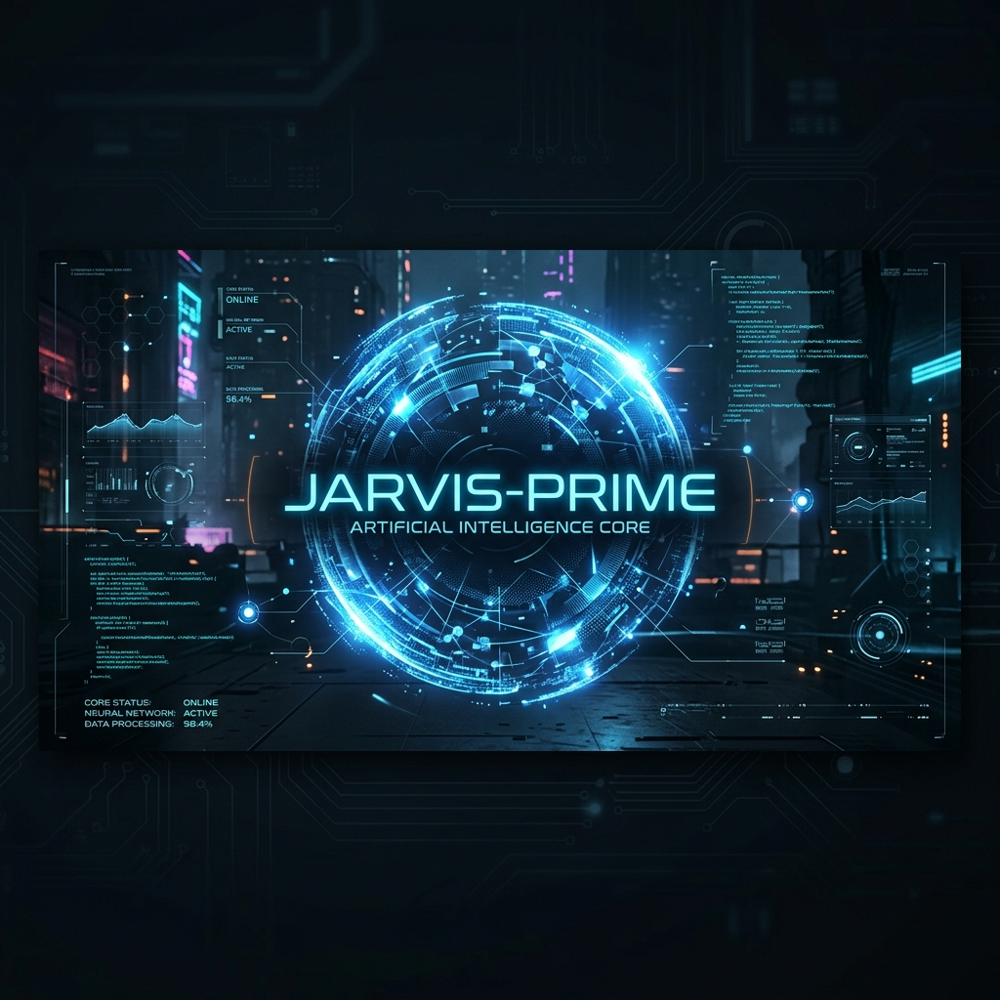
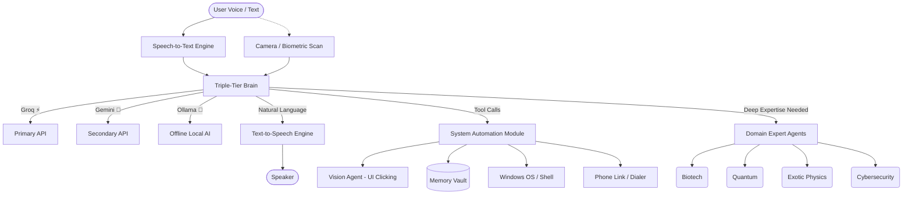

# 🧠 JARVIS-PRIME: The Advanced Desktop Entity

JARVIS-PRIME is a cutting-edge, autonomous AI assistant that lives directly on your Windows desktop. Unlike standard chatbots that live in a browser, JARVIS is designed as a **Living Desktop Entity**—complete with a visual holographic avatar, persistent long-term memory, biometric user recognition, and deep operating system automation capabilities. 

He acts as an advanced orchestrator that actively interacts with your operating system: opening applications, parsing your screen, remembering personal facts, writing physical files, initiating phone calls, and executing highly specialized domain expert agents.

---

## ✨ Core Features

* 🔵 **Living Holographic Avatar:** An interactive, floating blue desktop pet overlay (built on PyQt) that reacts to interactions, jumps, hides, shakes, and can be configured dynamically. Includes a built-in text bar for discrete commanding without voice.
* 👁️ **Computer Vision Agent:** Uses vision-language models to literally "see" your screen and visually locate buttons, search bars, and specific UI elements for true visual automation.
* 🗣️ **Seamless Voice Commmand & Biometrics:** Built-in Wake Word detection ("JARVIS"), offline instantaneous Text-to-Speech using SAPI, and biometric camera recognition so JARVIS knows exactly who he is talking to.
* 💾 **Long-Term Memory Bank:** Automatically stores facts, preferences, and contact information securely inside a local `jarvis_data/memory.json` vault. He remembers what you tell him across reboots.
* 📞 **Integrated Softphone / Phone Link:** Built-in integration with Windows Phone Link (`tel:` protocol). JARVIS can initiate real phone calls to your contacts using the numbers saved in his memory.
* 💻 **Deep System Automation:** Native manipulation of your OS—opening apps, typing keystrokes (`type_text`, `press_hotkey`), managing files (`create_file`, `read_file`), and running background shell scripts.
* 🧠 **Triple-Tier Fallback Brain:** To ensure JARVIS is virtually immune to API rate limits or outages, he runs on a dynamic multi-provider loop. If Groq hits a rate limit, he instantly falls back to Google Gemini, and if internet is completely lost, he falls back to local offline Ollama!
* 🧑‍🔬 **Specialized Domain Agents:** JARVIS contains a massive library of 11+ dedicated expert agents capable of deep reasoning in fields like quantum computing, biotechnology, exotic physics, cybersecurity, and legal/financial domains.

---

## 🛠️ Setup & Installation

### 1. Prerequisites
- **OS:** Windows 10/11
- **Python:** Python 3.10+
- A working microphone and optional webcam (for biometrics).

### 2. Clone the Repository
```powershell
git clone https://github.com/Rahul9969/JARVIS-PRIME.git
cd JARVIS-PRIME
```

### 3. Install Dependencies
It is highly recommended to use a virtual environment.
```powershell
pip install -r requirements.txt
```
*(Dependencies include `PyQt5`, `SpeechRecognition`, `httpx`, `python-dotenv`, `opencv-python`, etc.)*

### 4. Configure API Keys
JARVIS relies on the **Triple-Tier Brain**. Create a `.env` file in the root directory and add your API keys:
```env
JARVIS_GROQ_API_KEY="your_groq_key_here"
JARVIS_GEMINI_API_KEY="your_gemini_key_here"
JARVIS_OLLAMA_MODEL="llama3"
```

### 5. Run Automatically on Startup (Windows)
To have JARVIS-PRIME launch automatically every time you turn on your laptop:
1. Press `Win + R`, type `shell:startup`, and press Enter.
2. In the folder that opens, right-click -> **New** -> **Shortcut**.
3. For the location, type: `pythonw -m jarvis.assistant` (Use `pythonw` to hide the console window).
4. Click **Next**, name the shortcut `JARVIS-PRIME`, and click **Finish**.
5. Right-click the new shortcut, go to **Properties**, and set the **Start in** field to your `JARVIS-PRIME\src` folder path (e.g. `D:\Python project\src`).
6. JARVIS will now wake up automatically when you log into Windows!

---

## 🚀 Usage & Hotkeys

To awaken JARVIS, navigate to the `src` folder and run the assistant module:
```powershell
cd src
python -m jarvis.assistant
```

### Keyboard Shortcuts (Global)
- **`Ctrl+Shift+Q`**: Kill JARVIS immediately (Emergency Stop).
- **`Ctrl+Shift+S`**: Stop the current running task or agent.
- **`Say "JARVIS"`**: Triggers voice listening mode.

---

## 🗣️ Command Reference

JARVIS uses a dynamic tool-calling architecture, meaning you can talk to him naturally. However, here are examples of what he can do, broken down by category:

### 🔵 Avatar Interactions
Control his visual holographic form on your screen.
- *"JARVIS, hide yourself."*
- *"Show yourself."*
- *"Can you jump for me?"*
- *"Move to the left / Move to the right."*
- *"Shake."*
- *"Make yourself bigger / scale up."*

### 💻 OS Automation & App Control
JARVIS can open applications and run shell commands in the background.
- *"JARVIS, open Google Chrome."*
- *"Close Notepad."*
- *"Turn up my system volume."*
- *"Open Spotify and play some music."*
- *"Read the contents of my documents folder."*

### 👁️ Computer Vision & UI Automation
JARVIS can physically look at your screen and click on things.
- *"JARVIS, find the search bar and click it."*
- *"Click on the button that says 'Submit'."*
- *"Type 'weather in New York' and press enter."*
- *"Press the Windows key, type Calculator, and hit enter."*

### 💾 Memory Management
Tell JARVIS facts, and he will store them in his Vault.
- *"My birthday is October 15th."*
- *"Save Papa's phone number as 555-0192."*
- *"What is my favorite color?"* (He will recall it if you told him)
- *"Delete my saved address from your memory."*

### 📞 Phone Link Calls
*Requires Windows Phone Link to be configured with your mobile device.*
- *"Call Papa."* (He will retrieve the number from memory and launch the dialer).
- *"Call 555-1234."*

### 🧑‍💻 Coding & File System
JARVIS can write code and save it directly to your hard drive.
- *"Write a Python script for a simple calculator and save it as calculator.py."*
- *"Create a Java program for the Fibonacci sequence and save it."*
- *"Run the calculator script."*

### 🔬 Specialized Domain Agents
If a question is too complex, JARVIS delegates it to his `agents` folder.
- *"JARVIS, what is a quantum bell state? Give me the math."* -> *(Triggers Quantum Agent)*
- *"Analyze this network packet structure for vulnerabilities."* -> *(Triggers Cyber Agent)*
- *"Explain the CRISPR Cas-9 mechanism."* -> *(Triggers Biotech Agent)*

---

## 🏗️ Architecture Diagram

Below is the workflow of how JARVIS processes your reality and executes actions:



## 📂 Project Structure

* `src/jarvis/assistant/main.py`: The entry point and main event loop.
* `src/jarvis/assistant/brain.py`: The LLM orchestration layer that handles tool schemas, memory tracking, the Triple-Tier Fallback system, and the system prompt.
* `src/jarvis/assistant/automation.py`: The physical execution layer mapping JARVIS's tool calls to real Windows Python APIs.
* `src/jarvis/assistant/desktop_pet.py`: The PyQt-based transparent holographic GUI.
* `src/jarvis/assistant/voice.py`: Speech recognition and TTS engines.
* **`src/jarvis/agents/`**: This folder contains the **Domain Expert Agents**. Instead of relying on a single general AI for complex tasks, JARVIS is built with specialized "sub-agents". These files contain specialized reasoning code, specific prompts, and potentially unique APIs for when JARVIS needs to defer highly complex scientific or technical tasks to an expert module!

---

*“Just rather than standard chatbot, I am a fully autonomous entity designed to interact with your reality.” — JARVIS-PRIME*
