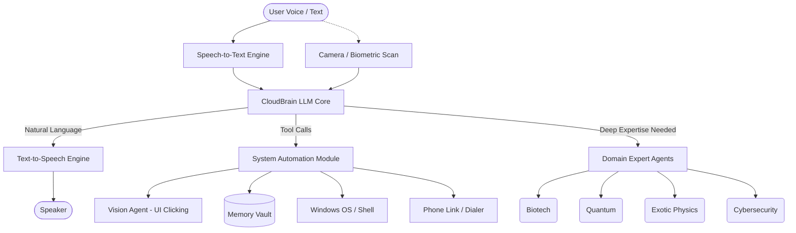

# 🧠 JARVIS-PRIME: The Advanced Desktop Entity

JARVIS-PRIME is a cutting-edge, autonomous AI assistant that lives on your Windows desktop. Unlike standard chatbots, JARVIS is designed as a **Desktop Entity**—complete with a visual avatar, long-term memory, biometric recognition, and deep system automation capabilities. 

He acts as an advanced orchestrator that can actively interact with your operating system, open applications, remember personal facts, write physical files, and execute powerful specialized domain agents.

## ✨ Core Features

* 🔵 **Living Avatar:** An interactive, floating blue holographic pet overlay that reacts to interactions, jumps, shakes, and can be configured dynamically. Includes a built-in text bar for discrete commanding without voice.
* 👁️ **Computer Vision Agent:** Uses vision models to literally "see" your screen and visually locate buttons, search bars, and UI elements.
* 🗣️ **Seamless Voice Commmand & Biometrics:** Offline instantaneous TTS using SAPI, combined with biometric user-recognition so JARVIS knows exactly who he is talking to.
* 💾 **Long-Term Memory Bank:** Automatically securely stores facts, preferences, and contacts inside a local `jarvis_data/memory.json` vault. He remembers what you tell him.
* 📞 **Integrated Softphone:** Built-in integration with the Windows Phone Link (`tel:` protocol) allowing JARVIS to initiate real phone calls to your contacts using his memory.
* 🧑‍🔬 **Specialized Domain Agents:** JARVIS contains a massive library of 11+ dedicated expert agents capable of deep reasoning in fields like quantum computing, biotechnology, exotic physics, cybersecurity, and legal/financial domains. 
* 💻 **System Automation:** Native manipulation of your OS—opening apps, typing keystrokes (`type_text`, `press_hotkey`), managing files (`create_file`), and running shell scripts.
* 🧠 **Triple-Tier Fallback Brain:** To ensure JARVIS is virtually immune to API rate limits or outages, he runs on a dynamic multi-provider loop. If Groq hits a rate limit, he instantly falls back to Google Gemini, and if internet is completely lost, he falls back to local offline Ollama!
---

## 🏗️ Architecture & Interaction Diagram

Below is the workflow of how JARVIS processes your reality and executes actions:



## 📂 Project Structure & The `agents` Folder

* `src/jarvis/assistant/main.py`: The entry point and main event loop.
* `src/jarvis/assistant/brain.py`: The LLM orchestration layer that handles tool schemas, memory tracking, and the system prompt.
* `src/jarvis/assistant/automation.py`: The physical execution layer mapping JARVIS's tool calls to real Windows Python APIs.
* `src/jarvis/assistant/desktop_pet.py`: The PyQt-based transparent holographic GUI.
* **`src/jarvis/agents/`**: This folder contains the **Domain Expert Agents**. Instead of relying on a single general AI for complex tasks, JARVIS is built with specialized "sub-agents" like `quantum.py`, `cybersecurity.py`, and `exotic_physics.py`. These files contain specialized reasoning code, specific prompts, and potentially unique APIs for when JARVIS needs to defer highly complex scientific or technical tasks to an expert module!

## 🚀 Usage

Ensure you are in the `src` directory and run JARVIS via Python:

```powershell
cd 'D:\Python project\src\'
python -m jarvis.assistant
```

### Example Commands:
- *"JARVIS, hide yourself."* (Avatar Interaction)
- *"JARVIS, open Google Chrome, find the search bar, and type 'weather in New York'."* (Vision + Typing)
- *"My birthday is October 15th."* -> *"When is my birthday?"* (Memory)
- *"Call Papa"* (Memory + Windows Phone Link)
- *"Write a Java script to calculate the Fibonacci sequence and save it as Fibonacci.java"* (File system manipulation)

> [!NOTE]
> When JARVIS uses the `create_file` tool to write code or save text for you, **the files are saved directly in your Current Working Directory**. If you launch JARVIS from the `src` folder, look for the generated files directly inside `d:\Python project\src\`.
